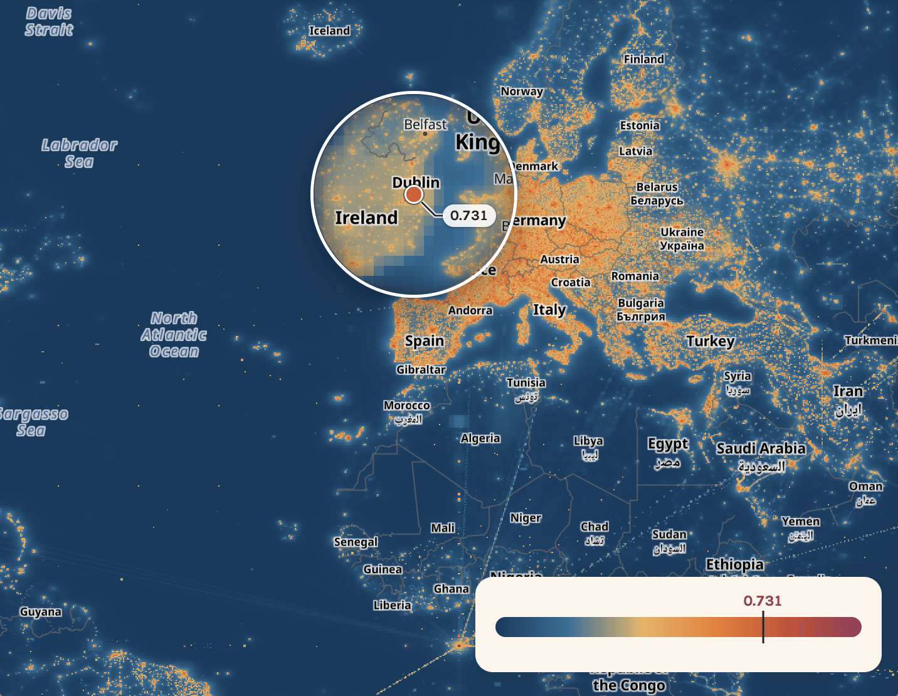

<!--
SPDX-FileCopyrightText: 2026 Sascha Brawer <sascha@brawer.ch>
SPDX-License-Identifier: MIT
-->

# OSMViews

**How much does the world look at a place?** OSMViews ranks every location
on Earth by how often people view it on
[OpenStreetMap](https://www.openstreetmap.org), down to ~150 m.
Updated weekly, averaged over a year, free for any use.

**→ [Explore the map](https://osmviews.brawer.ch)**

## Use the data

* **Python:** `pip install osmviews` — [osmviews-py](https://github.com/brawer/osmviews-py)
* **Rust:** `cargo add osmviews` — [osmviews-rs](https://github.com/brawer/osmviews-rs)
* **Download:** a Cloud-Optimized GeoTIFF, listed in
  [datapackage.json](https://osmviews.brawer.ch/data/datapackage.json) —
  see [docs/downloads.md](docs/downloads.md)

## Learn more

* [How it works](https://www.tdcommons.org/dpubs_series/11589) — a
  [defensive publication](docs/defensive-publication/) describing the pipeline
* [Contributing](CONTRIBUTING.md) · [Security](SECURITY.md) ·
  [Map app source](https://github.com/brawer/osmviews-app)

## License

Code: [MIT](LICENSE). Data and screenshot:
[CC0 1.0](https://creativecommons.org/publicdomain/zero/1.0/) (public domain).
Docs: CC BY 4.0.
